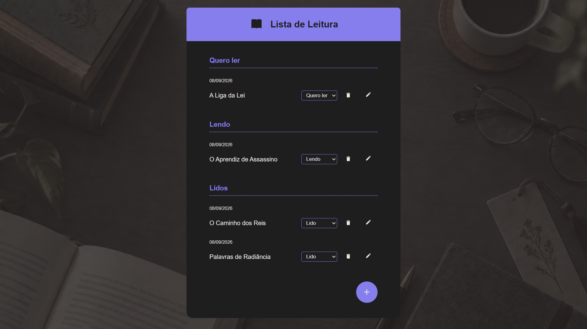
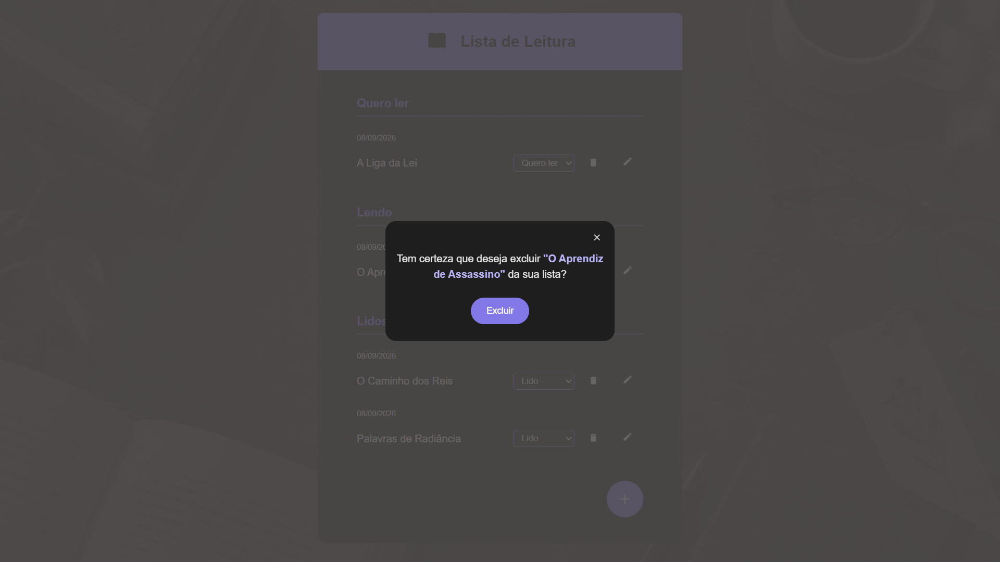

# 📚 Lista de Leitura

Aplicação desenvolvida em React para organizar livros de acordo com o status de leitura.

O projeto foi criado a partir de uma proposta prática de um curso de React da **Alura** e depois adaptado para o tema de leitura, com mudanças na lógica, na interface e em algumas funcionalidades.

## 🔗 Acesse o projeto

- **Deploy:** https://react-lista-de-leitura.vercel.app/

## ✨ Funcionalidades

- Adicionar novos livros à lista
- Editar o nome de um livro
- Excluir livros com confirmação antes da remoção
- Alterar o status de leitura por meio de um seletor
- Organizar os livros automaticamente em três categorias:
  - **Quero ler**
  - **Lendo**
  - **Lidos**
- Adicionar novos livros automaticamente em **Quero ler**
- Exibir mensagens específicas quando uma categoria está vazia
- Salvar os dados no `localStorage`
- Manter a lista salva mesmo após atualizar ou fechar a página

## 📖 Como funciona

Cada livro possui um status de leitura:

- `quero-ler`
- `lendo`
- `lido`

Ao adicionar um novo livro, ele entra automaticamente na categoria **Quero ler**.

O status pode ser alterado diretamente pelo seletor exibido ao lado de cada item. Quando o status é modificado, o livro é movido automaticamente para a seção correspondente.

Também é possível editar o título de um livro ou removê-lo da lista. Antes da exclusão, a aplicação exibe uma janela de confirmação para evitar remoções acidentais.

## 🛠️ Tecnologias utilizadas

- React
- JavaScript
- HTML
- CSS
- Context API
- `localStorage`

## 🧠 Conceitos praticados

Durante o desenvolvimento do projeto foram praticados conceitos como:

- Componentização
- Props
- Estado com `useState`
- Efeitos com `useEffect`
- Context API
- Renderização condicional
- Manipulação de listas com `map` e `filter`
- Formulários
- Eventos
- Reutilização de componentes
- Persistência de dados no navegador
- Uso do elemento `<dialog>`

## ✨ Adaptações realizadas

A proposta original do curso era um **Plano de Estudos**, com tarefas divididas entre pendentes e concluídas.

Depois da implementação da aula, o projeto foi adaptado para uma **Lista de Leitura**, com algumas mudanças na lógica e na experiência de uso:

- Substituição do sistema `completed` por três status: **Quero ler**, **Lendo** e **Lidos**
- Substituição da checkbox por um seletor de status
- Definição de **Quero ler** como status inicial de novos livros
- Criação de mensagens específicas para categorias vazias
- Adição de confirmação antes da exclusão
- Adaptação visual do projeto para o tema de leitura

## 💾 Persistência dos dados

Os livros são armazenados no `localStorage` do navegador.

Sempre que a lista é alterada, os dados são convertidos para JSON e salvos novamente. Dessa forma, os livros permanecem disponíveis mesmo depois que a página é recarregada ou o navegador é fechado.

## 📸 Preview

## 🎓 Sobre o projeto

Projeto desenvolvido como parte dos estudos de React na **Alura**.

Após a implementação da proposta apresentada no curso, foram feitas adaptações na temática, na estrutura dos dados, na experiência de uso e em elementos visuais da aplicação.
